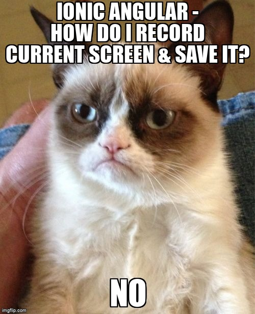
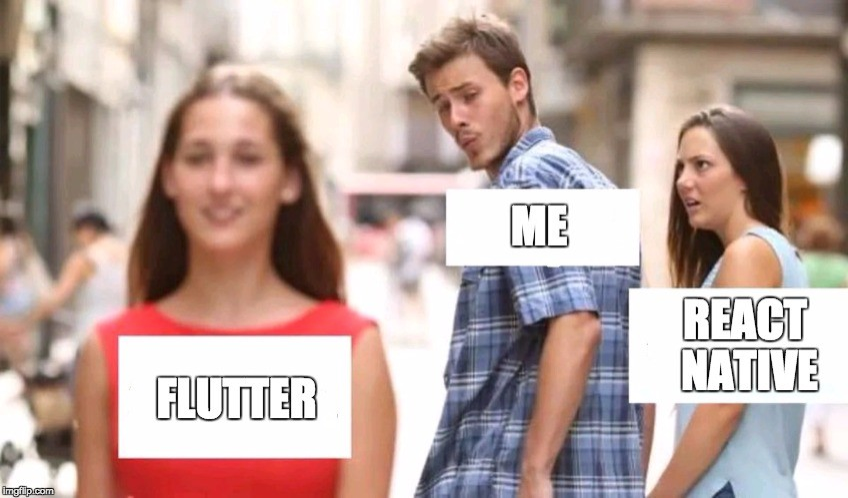

Flutter 

# Présentation générale

D'après le site officiel, Flutter est une boîte à outils permettant de créer nativement des applications mobile, web et bureau.
La notion d'application native étant elle même sujet à controverse, nous considérons dans cet article qu'une application est native si le code des composants est compilé ou interprété selon le système d'opération dans un langage qui lui permet d'être le plus performant (ex: Pour Flutter, le Dart est compilé en C++; pour ReactNative, le JS est interprété en Java sur Android, Objective C pour iOS et C# pour Windows) à l'inverse des Frameworks (outils de développement) hybrides tels qu'Ionic reposant sur une surcouche Web pour construire ses composants.

## Un code, plusieurs plateformes

Ce concept n'est pas nouveau. React Native, Xamarin ou encore Ionic sont des frameworks proposants déjà ce type service. Il s'agit sûrement de l'un des arguments principaux poussant les entreprises et les développeurs à s'intéresser à ces technologies.

La **réduction drastique du temps de développement** induite par la **mutualisation du code** va de pair avec la **simplification** globale de la complexité de l'application. Fini la recherche couplée de spécialistes Android et de spécialistes iOS, un unique développeur sera capable de modifier le code responsable d'une fonctionnalité. Une **réduction des coûts de développement** est alors évidente.

## Mais alors, pourquoi toutes les entreprises ne le font pas ...?

Bien entendu, dans les faits, ce n'est pas si simple (sinon il n'existerait plus d'embauche de spécialistes...). En effet, l'utilisation de ces frameworks n'est pas forcément adaptée à tous les projets. On pourra retenir, en guise de simplification, qu'**une application dite "complexe" a plus d'intérêts à être développée nativement (ie avec un code distinct selon les plateformes)** pour l'instant. On entend ici par "complexe" une application nécessitant beaucoup d'outils liés au hardware (géolocalisation, utilisation de capteurs, utilisation poussée de la caméra...), dont **le rendu visuel doit être IMPERATIVEMENT conforme aux maquettes** ou encore nécessitant de **"gros calculs"**.

Ceci s'explique par le fait que le code de ces fonctionnalités est **intrinsèquement dépendant du support utilisé**, il est donc difficile d'avoir une entrée unique pour chacun des différents cas qui pourraient se présenter sans devoir faire **un compromis au niveau des performances**. 

**Ce problème de performance** provient de la **surcouche** nécessaire à traduire l'unique code écrit par le développeur en plusieurs qui s'adaptent au mieux au support utilisé. Heureusement, cette surcouche a tendance à s'amoindrir avec le temps et les problèmes de performance autrefois connus avec les applications hybrides, sont beaucoup moins flagrants sur les frameworks actuels.

De nos jours, la grande majorité des applications (95% des applications que vous utilisez) est codée à l'aide de frameworks n'utilisant qu'un seul et unique code. 

*Exemples d'applications utilisant un unique code:* 

Instagram (ReactNative), UberEats (ReactNative) Facebook (ReactNative), Discord (ReactNative), Alibaba (Flutter), Groupon (Flutter), Ebay (Flutter).

*Exemples d'applications utilisant un code différent selon les plateformes:* 

OuiSNCF (Java/Swift), PokemonGo, Google Maps.

## Ok, mais alors pourquoi Flutter et pas les autres ? 

Passionné de développement mobile, j'ai très vite voulu faire un tour d'horizon des différents outils mis à ma disposition afin de me forger ma propre idée sur ces derniers et ainsi choisir sur lesquels de ces Frameworks je souhaiterais davantage me pencher. **Propriétaire d'un Android**, je m'étais au préalable formé au développement sur Android en Java et je n'avais alors **aucune expérience Web** si ce n'est que la création de sites statiques. Je pense que cette information est à noter afin d'expliquer au mieux les choix et les ressentis que j'ai pu avoir lors de ce parcours, bien que je me baserai principalement sur des éléments que je considère objectif.

#### Les débuts du voyage "Cross-Platform" avec Ionic (~2016)

Ionic a été le premier Framework que j'ai eu l'occasion d'essayer. Ayant développé jusqu'alors uniquement des applications Android natives en Java, il faut avouer que j'étais relativement content de découvrir une alternative JavaScript. Mes besoins étaient faibles : pas de pression au niveau des performances, aucune inquiétude quant aux visuels, je voulais simplement découvrir une autre façon de faire afin de pouvoir en tirer une comparaison. 

Le développement de l'application était relativement satisfaisant. On sent dès le début une approche beaucoup plus orientée Web que mobile. Je découvrai également le **"Live Reload"**.

Cette option permet de recharger automatiquement l'application lorsque des changements sont détectés et, soyons clair ici, cela a révolutionné ma vision du développement qui reposait jusqu'alors sur des builds relativement longs de l'application (je n'avais, à l'époque, pas connaissance des joies de la compilation iOS, partenaire officiel de mes pauses cafés...). Outre cette fonctionalité, la **courbe d'apprentissage** m'a paru relativement faible : on en vient rapidement à maîtriser les fondamentaux pour pouvoir réaliser une application correcte, même sans aucune connaissance préalable. 

Malgré tout, l'**ajout de fonctionnalités nécessitant l'API Native était dans mon souvenir désagréable**. Je devais utiliser les fonctionnalités "TextToSpeech", "SpeechToText" et le gyroscope. Toutefois, au moins une d'entre elle était encore en bêta et lors de la rédaction de cette article, au vue de la [nouvelle documentation](https://ionicframework.com/docs/v3/native/), beaucoup de choses semble avoir évolué et cet écueil ne semble plus être d'actualité. 

Une chose est sûre toutefois, le chargement initial d'ouverture l'application était long. Un manque de fluidité globale (lors de changement de page notamment) donnait une **expérience utilisateur amoindrie**. 

Si je devais résumer en un mot mon expérience avec Ionic, j'utiliserai le mot "Avenir". Une impression de "brouillon" était toujours présent. Nous en étions encore très tôt au niveau de développement d'Ionic, aussi je pense bon de redonner une chance à ce Framework. Je n'étais toutefois pas mécontent de mon expérience et **il m'a poussé à croire en cette nouvelle vague de Frameworks** et à tester le nouveau géant de ce domaine : ReactNative.

#### La montée en puissance avec ReactNative (~2017/2018)

Globalement, j'ai vu ReactNative comme une **version améliorée d'Ionic**. Les principes de développement me paraissaient plus clairs avec ReactNative et poussent les personnes à utiliser rapidement les bonnes pratiques. 

De plus, l'existence d'**Expo**, une plateforme sous la forme d'application permettait de faire tourner son application mobile sur n'importe quel support ayant téléchargé Expo et ainsi, s'abstraire des stores. Très intéressante pour faire tourner une application rapidement sur le portable d'un ami, avec du recul je pense que cet atout est négligeable car, soyons honnête, qui ici a Expo de télécharger sur son téléphone ? 

Si le **rendu visuel était plus fidèle** d'un téléphone à l'autre et que la **fluidité** était bien au rendez-vous, un gros point négatif m'a cependant découragé de l'utilisation de ReactNative pour mes projets : **les mises à jours**. A la moindre mise à jour, c'était reparti pour une soirée à débugguer quelles versions étaient compatibles entre elles, pourquoi un composant était cassé...  

Finalement, je ne pensais redonner ma chance à ReactNative qu'une fois la v1 validée. D'autant plus que le développement natif Android s'est vu grandement amélioré avec l'arrivée de Kotlin (en Beta puis de façon officielle). Cependant, c'était avant d'avoir découvert le nouveau bijou de Google : Flutter.

#### Les sommets avec Flutter (~2019)

https://stackoverflow.com/questions/54401851/what-is-the-difference-between-react-native-and-flutter

Flutter uses Dart, a typed language that offers both "Just in time" (JIT) and "Ahead of time" (AOT) compilation (with tree-shaking included)

In development, Flutter uses JIT compilation to empower hot-reload. And for production builds, it uses AOT compilation for better performances.

React-Native uses Javascript enhanced by some syntax sugar called JSX.

JSX being a different language, it compiles to JS, then evaluated at runtime.

https://medium.com/flutter-community/flutters-key-difference-owning-every-pixel-e2135b44c8a

Fonctionnalité | Ionic | ReactNative | Flutter | Native (Android/iOS)
--- | --- | --- | --- | ---
Courbe d'apprentissage | Basse | Moyenne | Haute | Très haute
Hot Reload | Oui | Oui | Oui | "Instant Run"
Stabilité |Oui|Non (0.63)|Oui (1.22.5)|Oui|
UX | - | + | + | ++ |
DX | + | + | ++ | -/+ |
Facilité à dev UI | + | ++ | +++ | ++ 
API (native) | - (?) | ++ | ++ | 
Coût | -- | -- | - | + |

https://stackoverflow.com/questions/52050660/difference-between-androids-instant-run-vs-flutters-hot-reload-and-react-nativ

# Références utilisées

https://fr.wikipedia.org/wiki/Skia

https://relevant.software/blog/top-8-flutter-advantages-and-why-you-should-try-flutter-on-your-next-project/

https://hub.packtpub.com/react-native-really-native-framework/